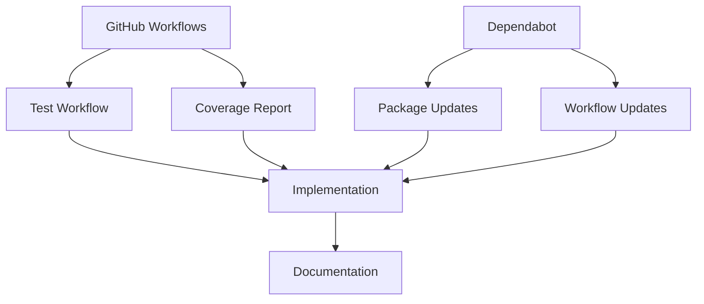

# GitHub Workflows and Dependabot Implementation Plan

Based on a review of the project's Memory Bank, testing structure, and configuration files, this plan outlines how to implement GitHub workflows for tests and add Dependabot for dependency management.

## Current Project Context

The LangGraph Builder Implementation Guide is a template/guide for implementing LangGraph Builder exports, demonstrated with a Claude chat example. The project:

- Uses TypeScript with Jest for testing
- Has a simplified test structure with consolidated test files
- Uses pnpm as the package manager (required per .clinerules)
- Currently has tests running locally with Jest

## Implementation Plan



### 1. GitHub Workflows Implementation

We'll create a GitHub workflow for running tests that:

- **Runs on**:
  - Push to main branch
  - Pull requests targeting main
  - Manual trigger (workflow_dispatch)

- **Core Steps**:
  - Set up Node.js environment
  - Install pnpm
  - Install dependencies using pnpm
  - Run tests with coverage reporting
  - (Optional) Upload coverage reports as artifacts

- **File Structure**:

  ```
  .github/
    workflows/
      tests.yml
  ```

### 2. Dependabot Configuration

We'll implement Dependabot to:

- **Monitor Dependencies**:
  - Check npm packages for updates
  - Check GitHub Actions for updates

- **Configuration**:
  - Schedule weekly checks
  - Group related dependency updates
  - Configure for pnpm compatibility

- **File Structure**:

  ```
  .github/
    dependabot.yml
  ```

### 3. Implementation Details

#### Test Workflow (tests.yml)

```yaml
name: Run Tests
on:
  push:
    branches: [main]
  pull_request:
    branches: [main]
  workflow_dispatch:

jobs:
  test:
    runs-on: ubuntu-latest
    steps:
      - uses: actions/checkout@v4
      - uses: actions/setup-node@v4
        with:
          node-version: '20'
      - uses: pnpm/action-setup@v2
        with:
          version: latest
      - name: Install dependencies
        run: pnpm install
      - name: Run tests
        run: pnpm test
      - name: Upload coverage report
        uses: actions/upload-artifact@v4
        with:
          name: coverage-report
          path: coverage/
```

#### Dependabot Configuration (dependabot.yml)

```yaml
version: 2
updates:
  # Check for updates to npm packages
  - package-ecosystem: "npm"
    directory: "/"
    schedule:
      interval: "weekly"
    commit-message:
      prefix: "deps"
    groups:
      development-dependencies:
        patterns:
          - "@types/*"
          - "*jest*"
          - "ts-*"
        exclude-patterns:
          - "@langchain/langgraph" # Core dependency, keep separate
      production-dependencies:
        patterns:
          - "@anthropic-ai/sdk"
          - "@langchain/langgraph"
          - "dotenv"

  # Check for updates to GitHub Actions
  - package-ecosystem: "github-actions"
    directory: "/"
    schedule:
      interval: "weekly"
    commit-message:
      prefix: "ci"
```

### 4. Documentation Updates

We'll update the project documentation to include:

- Information about the CI/CD workflows
- How to interpret test results
- How Dependabot is configured
- Process for reviewing and accepting dependency updates

## Considerations and Benefits

1. **Test Reliability**:
   - Consistent test environment in GitHub Actions
   - Clear reporting of test failures
   - Coverage metrics tracked over time

2. **Dependency Management**:
   - Automated checks for security updates
   - Regular maintenance of dependencies
   - Grouped updates to minimize PR noise

3. **Project Standards**:
   - Maintains pnpm as required by project rules
   - Follows the project's testing approach
   - Supports the project's focus on implementation patterns

## Implementation Status

- [ ] Create GitHub workflow configuration
- [ ] Create Dependabot configuration
- [ ] Test workflow with sample commit
- [ ] Document CI/CD process
- [ ] Update Memory Bank with implementation details
