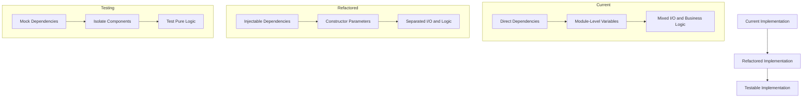

# Implementation Testability Refactoring Plan

This document outlines the plan for refactoring the LangGraph Builder example implementations to improve testability while establishing best practices that align with real-world application needs.

## Goals

1. **Establish Testability Patterns**: Create reusable patterns for testing LangGraph Builder implementations
2. **Improve Test Coverage**: Increase test coverage of core functionality beyond state management
3. **Demonstrate Best Practices**: Show how to structure LangGraph implementations for better maintainability
4. **Minimize Maintenance Overhead**: Keep tests focused and maintainable despite improved coverage

## Refactoring Approach

### 1. Dependency Injection Refactoring



Key changes:

1. **Service Abstraction**:
   - Create interfaces for external services (Anthropic, CLI I/O)
   - Implement concrete service classes that can be replaced with mocks
   - Separate concrete implementation from interface definition

2. **Dependency Injection**:
   - Move module-level variables to constructor parameters
   - Create factory functions for constructing with real or mock dependencies
   - Use dependency injection in node functions

3. **Separation of Concerns**:
   - Separate I/O operations from state transformation logic
   - Create pure functions for core business logic
   - Isolate side effects in dedicated components

### 2. Implementation Structure Changes

Revised file structure:

```
examples/claude-chat/
  ├── constants.ts            # Constants remain unchanged
  ├── types.ts                # Enhanced with interface definitions
  ├── services/               # NEW: Service implementations
  │   ├── interfaces.ts       # Service interfaces
  │   ├── anthropic.ts        # Anthropic service implementation
  │   └── io.ts               # I/O service implementation
  ├── implementation.ts       # Refactored with dependency injection
  ├── index.ts                # Entry point with service wiring
  └── factories.ts            # NEW: Factory functions for testing
```

## Enhanced Test Suite Design

### Test Categories

1. **State Management Tests**:
   - Continue testing state structure and transformations
   - Add tests for complex state transitions

2. **Service Interaction Tests**:
   - Test how nodes interact with services
   - Verify correct parameter passing and return handling

3. **Node Logic Tests**:
   - Test individual node functions with mocked dependencies
   - Verify decision logic and routing

4. **Graph Integration Tests**:
   - Test the complete graph with mocked services
   - Verify correct flow through the graph

### Test Structure

```
tests/examples/claude-chat/
  ├── state.test.ts           # State management tests
  ├── services.test.ts        # Service interaction tests
  ├── nodes.test.ts           # Individual node tests
  └── integration.test.ts     # Graph integration tests
```

## Documentation Updates

1. **Implementation Guide**:
   - Document the dependency injection pattern
   - Explain how to structure testable LangGraph implementations
   - Provide examples of decoupling external services

2. **Testing Guide**:
   - Document testing strategies for different components
   - Explain mocking approaches for external services
   - Show how to test state transformations

3. **Code Comments**:
   - Add comments explaining testability patterns
   - Highlight separation of concerns in the implementation
   - Document testing considerations in key components

## Implementation Plan

### Phase 1: Refactoring

1. Create service interfaces and implementations
2. Refactor implementation.ts to use dependency injection
3. Create factory functions for testing
4. Update index.ts to wire services correctly

### Phase 2: Test Enhancement

1. Update existing tests to work with refactored implementation
2. Add service interaction tests
3. Add node logic tests
4. Add graph integration tests

### Phase 3: Documentation

1. Update documentation with testability patterns
2. Add testing guide to project documentation
3. Update code comments to explain testability considerations

## Expected Benefits

1. **Better Example Quality**: Provides more production-ready examples
2. **Improved Understanding**: Helps users understand how to test their implementations
3. **Reusable Patterns**: Establishes patterns that can be applied to any LangGraph export
4. **Maintainability**: Makes the codebase easier to maintain and extend
5. **Real-world Applicability**: Better represents how LangGraph apps would be implemented in production

This plan balances the need for improved testability with the project's goal of keeping maintenance overhead manageable by focusing on reusable patterns and clear documentation.
