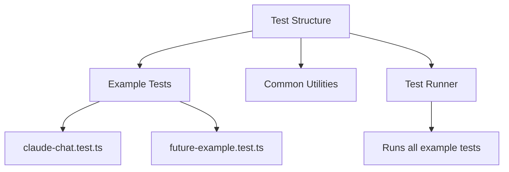

# Simplified Test Suite Strategy for LangGraph Builder Examples

This document outlines a simplified test suite structure for the LangGraph Builder example applications. The approach prioritizes low maintenance overhead while ensuring proper testing coverage for each example app.

## Testing Strategy



### Simplified Test Structure

Recommended directory structure:

```tree
/tests
  /examples
    claude-chat.test.ts         # Single consolidated test file per example app
    future-example.test.ts      # (when needed)
  common.ts                     # Minimal shared testing utilities
  test-all.ts                   # Simple test runner
```

### Claude Chat Test Implementation

For the claude-chat example, we'll use a single test file with focused test cases:

```typescript
// claude-chat.test.ts
describe('Claude Chat Example', () => {
  // Test basic functionality
  test('creates initial state correctly', () => {
    // Test initialization
  });

  test('processes user input and returns responses', () => {
    // Mock Anthropic API
    // Test basic conversation flow
  });

  test('handles errors gracefully', () => {
    // Test error cases
  });
});
```

### Mock Strategy

A simplified mock approach for external dependencies:

1. **Anthropic API Mock**
   - Simple mock for API responses
   - Basic error condition testing
   - Minimal request validation

2. **Readline Mock**
   - Basic mock for user input simulation
   - Simple command handling testing

### Test Runner

The test-all.ts will be a simple file that:

1. Imports all test files from the examples directory
2. Provides a way to run all tests with a single command

### Technologies

Recommended testing technologies:

- Jest/Vitest for the testing framework (compatible with TypeScript)
- Simple mock implementations for external dependencies
- Basic validation testing

## Implementation Plan

1. Set up the minimal testing framework and directory structure
2. Create simple mocks for external dependencies
3. Implement the claude-chat test file
4. Create a basic test runner
5. Document the pattern for adding additional example tests
