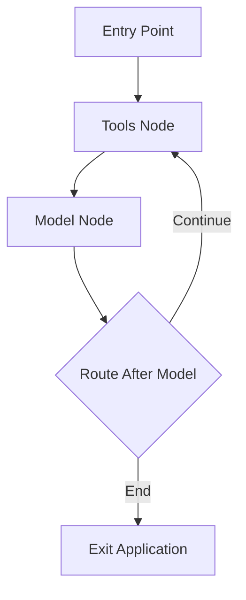

# System Patterns: LangGraph Builder Implementation Guide

## Architecture Overview

The LangGraph Builder Implementation Guide demonstrates a reusable architecture for implementing any LangGraph Builder export. The architecture patterns described here can be applied regardless of the specific application being built. The Claude chat example serves as a concrete demonstration of these patterns.



## Core Implementation Patterns

### 1. LangGraph Builder Export Structure

All LangGraph Builder exports follow a common structure:

- **spec.yml**: Defines the graph architecture (nodes, edges, conditions)
- **stub.ts**: Provides the TypeScript scaffolding that implements the graph structure
- **implementation.ts**: Contains placeholders for business logic

This structure enables:

- Visual design of application flow in LangGraph Builder
- Automatic generation of the core application structure
- Clear separation between architecture and implementation
- Targeted focus on business logic rather than graph structure

### 2. State Management Pattern

The implementation uses a centralized state management approach:

- State is defined as a TypeScript interface specific to the application's needs
- The interface is connected to LangGraph's typing system via Annotations
- Nodes receive state and return state updates following immutable patterns
- Updates are applied by LangGraph to create the next state

This pattern can be adapted to any LangGraph application by:

- Defining a state interface appropriate for your application
- Creating annotations that connect your interface to LangGraph
- Implementing node logic that properly updates the state

### 3. Functional Node Pattern

Each node in any LangGraph application should be implemented as a functional unit:

- Nodes take state as input and return state updates
- Nodes are organized by responsibility
- Node implementations focus on business logic
- Asynchronous operations follow consistent patterns

This implementation pattern can be applied to any LangGraph Builder export by:

- Analyzing the node's purpose in the graph
- Implementing the appropriate business logic
- Handling asynchronous operations consistently
- Maintaining proper state typing

### 4. Message Passing Pattern

Many LangGraph applications involve structured message passing between components:

- Messages follow a consistent structure appropriate to the application
- Message history is maintained in the application state
- State updates include appending new messages to the history
- External services receive appropriately formatted message history

This pattern is demonstrated in the Claude chat example but can be adapted for:

- Other LLM integrations
- Structured communication between nodes
- API interactions requiring state context

## Implementation Design Patterns

### 1. External Service Integration Pattern

When integrating external services (like Claude in our example):

- **API Client Abstraction**: Interaction with Claude is abstracted through the Anthropic SDK
- **Context Management**: System messages and conversation history are handled separately
- **Error Handling**: Errors from the API are caught and translated into user-friendly messages

This pattern can be adapted for any external service integration by:

- Using appropriate client libraries or APIs
- Managing context based on the service's requirements
- Implementing consistent error handling
- Converting service responses to appropriate state updates

### 2. Input/Output Pattern

For handling various forms of input and output:

- **I/O Abstraction**: Input/output mechanisms are abstracted based on application needs
- **Command Processing**: Input is processed according to application-specific rules
- **State Update**: Processed input is captured in the state for use by other nodes

### 3. Entry Point Pattern

The entry point follows a consistent initialization pattern applicable to any LangGraph application:

- Environment setup and validation
- Initial state creation with appropriate defaults
- Graph compilation and invocation
- Global error handling
- Resource management and cleanup

This pattern provides a consistent way to bootstrap any LangGraph application regardless of its specific purpose.

## Data Flow Patterns

### 1. Adaptable Data Flow

The implementation demonstrates how to handle data flow for any graph structure:

```
Input Source → Processing Nodes → Output Destination → (repeat as needed)
```

This pattern can be adapted to any LangGraph Builder export by:

- Identifying the appropriate input sources
- Mapping processing through the node structure
- Connecting to the appropriate output destinations

### 2. State Transformation Chain

Each node in the flow transforms the state according to its responsibility:

1. **Input Nodes**: Capture and validate inputs from various sources
2. **Processing Nodes**: Transform inputs and generate outputs
3. **Routing Nodes**: Determine the next steps in the application flow

This pattern can be applied to any LangGraph Builder export by:

- Identifying each node's responsibility in the state transformation chain
- Implementing appropriate transformation logic
- Ensuring proper state typing throughout the chain

## Extension Patterns

The implementation provides clear patterns for extending and adapting to new exports:

### 1. Boilerplate Replacement Pattern

New LangGraph Builder exports can be integrated by:

- Replacing spec.yml, stub.ts, and implementation.ts with new exports
- Adapting the state interface to match the new application's needs
- Implementing business logic for the new nodes
- Updating the entry point to use the new graph

### 2. Tool Integration Pattern

New capabilities can be integrated by:

- Identifying the appropriate integration point in the graph
- Implementing the integration logic within the relevant nodes
- Updating the state interface to support the new capability
- Adding appropriate routing logic if needed

### 3. State Extension Pattern

The state management approach can be extended for any application:

- The state interface can be customized for different applications
- State management logic can be adapted for different requirements
- Type safety is maintained through LangGraph annotations

This pattern enables adapting the implementation to any LangGraph Builder export by defining an appropriate state interface and connecting it to the graph.
